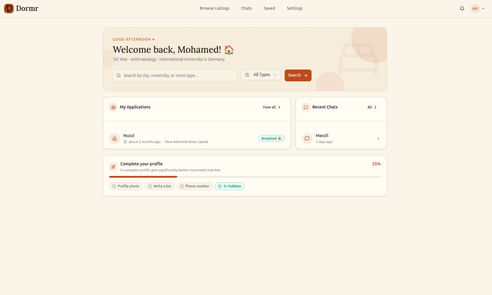
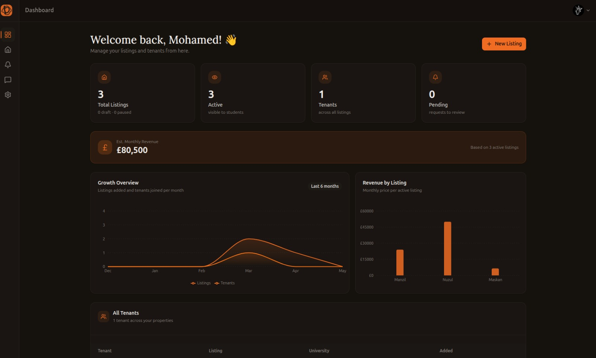
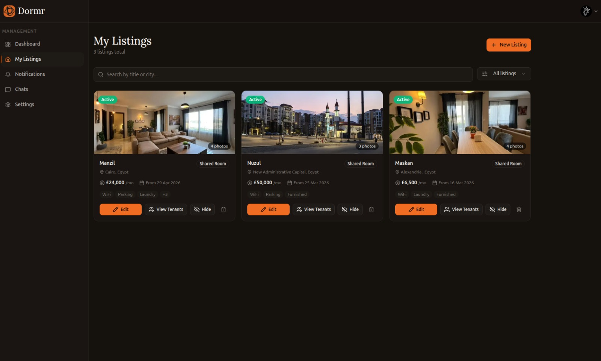
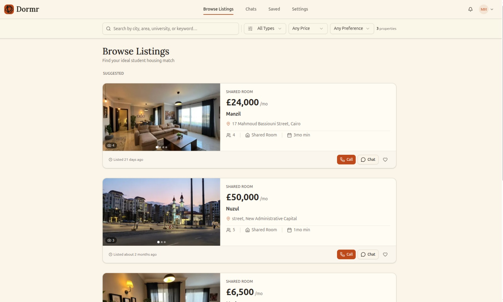
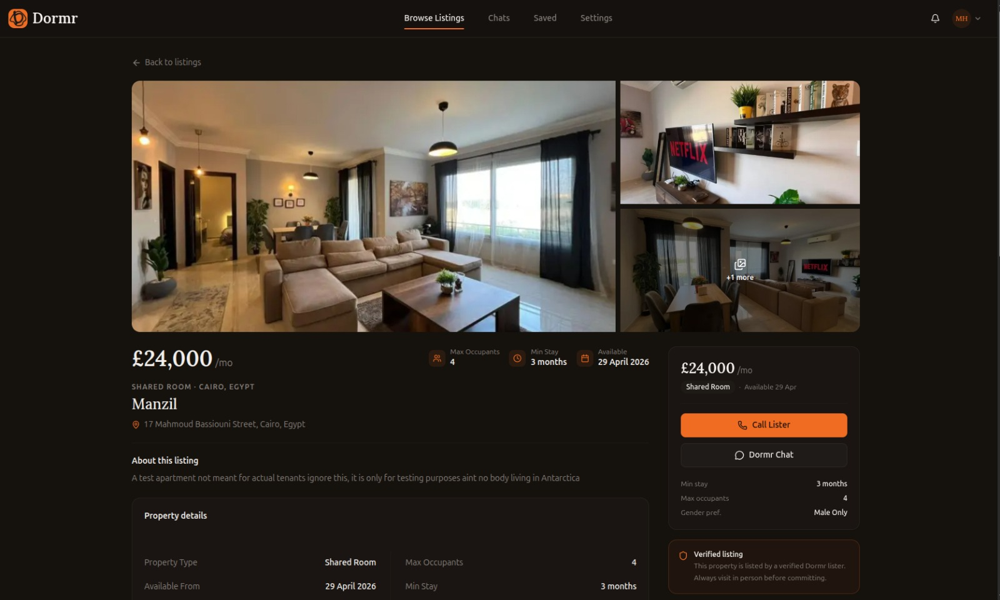
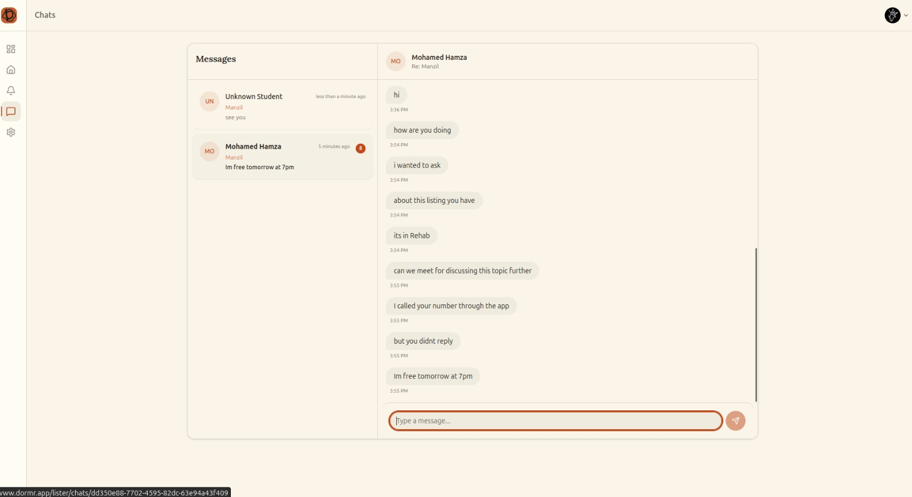
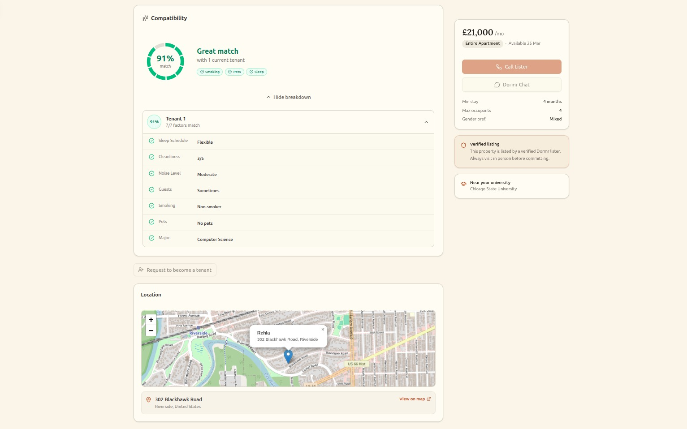

# Dormr


Dormr is a student housing marketplace for university students and listers. It helps students find compatible accommodation, message listers in real time, and manage tenant requests. Listers get their own dashboard for listings, applications, notifications, and analytics.

## Core features

- Matches students to listings and current tenants using a compatibility algorithm.
- Supports separate student and lister accounts.
- Provides real-time chat between students and listers using Supabase websockets.
- Includes full dashboards for both roles with analytics and operational views.
- Handles the full notifications flow for requests, approvals, and updates.
- Uses React Query for prefetching, caching, and fast navigation.
- Supports dark mode and light mode.
- Responsive and mobile-friendly.

## Tech stack

- Next.js 16 with the App Router
- React 19
- TypeScript
- Supabase for auth, Postgres, realtime, and storage
- Tailwind CSS 4
- `zod` for runtime validation and schema safety
- `@tanstack/react-query` for caching and prefetching
- `recharts` for lister analytics charts
- `leaflet` for listing maps and location selection
- `react-hook-form` and `@hookform/resolvers` for forms
- `zustand` for persisted client state
- `sonner` for notifications
- `lucide-react` for iconography

## App Images

<div>
  
  
  <br />
  
  
  <br />
  
  
  <br />
  
</div>

## Local setup

```bash
npm install
npm run dev
```

Set the required Supabase environment variables in `.env.local` before running the app.

## Environment variables

```bash
NEXT_PUBLIC_SUPABASE_URL=
NEXT_PUBLIC_SUPABASE_PUBLISHABLE_OR_ANON_KEY=
```
